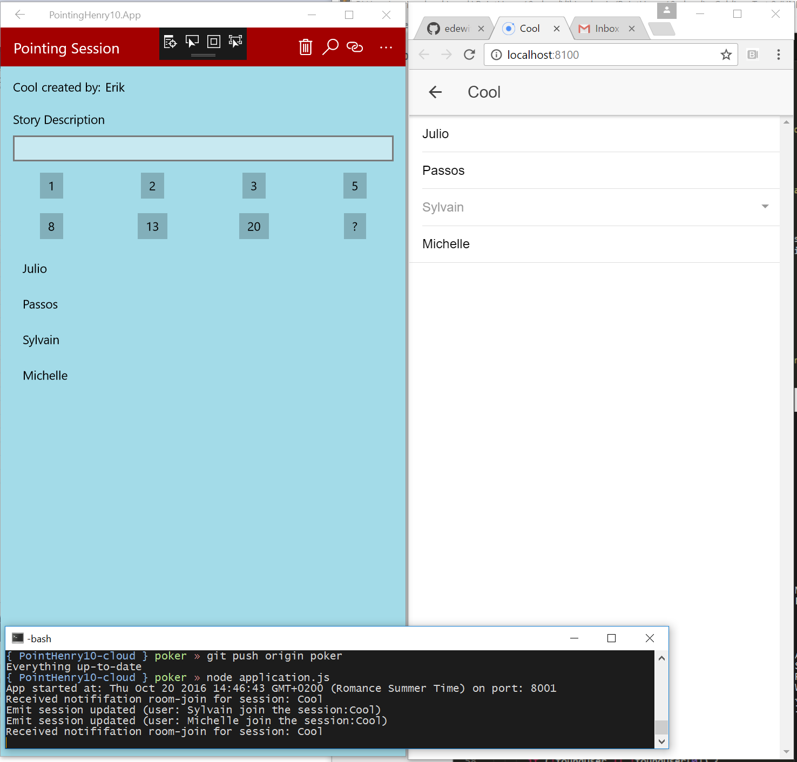

Pointing C# App
===============
Author: Summers Pittman, Erik Jan de Wit , Corinne Krych  
Level: Intermediate   
Technologies: C#, socket.io
Summary: A demonstration of how to use socket.io and FH.SDK.   
Community Project: [Feed Henry](http://feedhenry.org)    
Source: https://github.com/RHMAP-Sample-Mobile-Apps/pointing-dotnet-app   
Prerequisites: Visual Studio 2015+    

## What is it?

This application works with [Pointing Cloud App](https://github.com/RHMAP-Sample-Mobile-Apps/pointing-cloud) cloud app and need it up and running. Different version of the app exist for other platforms like [pointing-cordova-app](https://github.com/RHMAP-Sample-Mobile-Apps/pointing-cordova-app).

## Build instructions

* Run server locally, see [Pointing Poker cloud app](https://github.com/RHMAP-Sample-Mobile-Apps/pointing-cloud) .
* Open in VS and run
```
open PointingHenry10.sln
```

> You can also points your app to a remote RHMAP location using a `fhconfig.local.json`


# Build and Run
* you can also install the [web app version](https://github.com/edewit/PointHenry-app)
